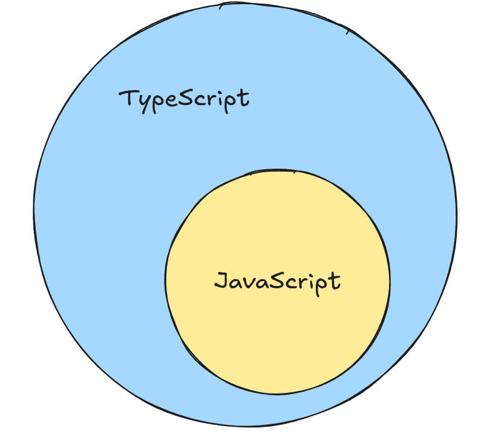
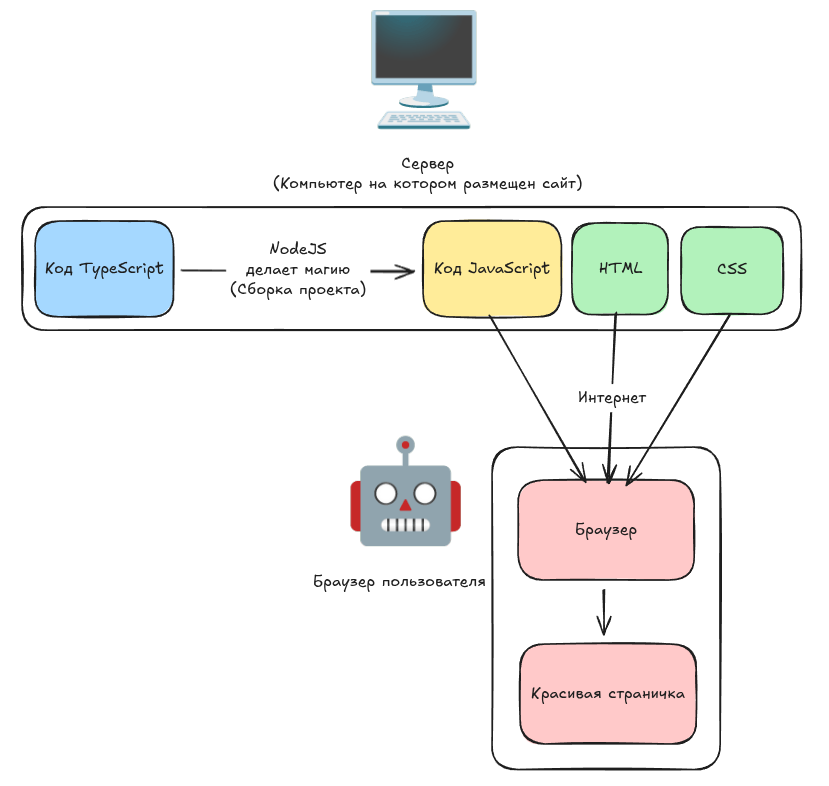

# TypeScript для хлебушков

>Перед началом программирования очень длинный гайд на то как все установить и настроить, я склоняюсь к тому, что это нужно пройти хотя-бы раз, но если прям не в моготу - [Онлайн редактор TypeScript](https://www.typescriptlang.org/play/), тогда можно пропустить: 2.Подготовьте все нужное, 3.Создание проекта

---
# 1. Что такое TypeScript и зачем он нужен



**TypeScript** - это надстройка над JavaScript, которая добавляет:
1. статическую типизацию
2. проверку ошибок **до запуска кода**
3. улучшенный автокомплит и навигацию
4. удобную работу с большими кодовыми базами (во многом из-за 3-его пункта)



TypeScript **переводится (транспилируется) в обычный JavaScript**, и до браузера пользователя он не доходит

---
### Проблема JavaScript

```js
function sum(a, b) {
  return a + b;
}

sum(2, "3"); // "23" — ошибка логики, но JS не ругается
```

Ошибка проявится только во время выполнения.

### Решение с TypeScript

```ts
function sum(a: number, b: number): number {
  return a + b;
}

sum(2, "3"); // ❌ ошибка ещё на этапе разработки
```

TypeScript **не даёт написать неправильный код**

---
# 2. Подготовьте все нужное:

Вы могли не заметить, но вы нигде не скачивали JavaScript на свой компьютер. Его и нет. JavaSctipt выполняется в браузере, а не на компьютере напрямую, поэтому JS будет работать, пока есть браузер, где его можно открыть.

Но сейчас нам понадобится запускать JavaScript на компьютере напрямую, для этого нам нужно скачать nodeJS. Это движок JavaScript, который достали из Google Chrome и настроили

## Windows

1. Перейди на официальный сайт Node.js:  
    [https://nodejs.org/](https://nodejs.org/)
    
2. Скачай **Windows Installer** (файл с расширением `.msi`)
	
3. Запусти скачанный установщик и следуй инструкциям (рекомендуется оставить все опции по умолчанию, включая установку npm).
    
4. После установки открой терминал VS code и проверь версии:
    
    ```bash
    node -v
    npm -v
    ```
    

---

### Mac (macOS)

#### Способ 1: Через официальный установщик

1. Перейди на [https://nodejs.org/](https://nodejs.org/) и скачай macOS Installer (`.pkg`).
    
2. Запусти установщик и следуй инструкциям.
    
3. Проверь установку в терминале:
    
    ```bash
    node -v
    npm -v
    ```
    

---

#### Способ 2: Через пакетный менеджер Homebrew (рекомендуется)

Если у тебя установлен [Homebrew](https://brew.sh/), выполни в терминале:

```bash
brew install node
```

Проверить версии:

```bash
node -v
npm -v
```

---

### Linux

#### Способ 1: Через менеджер пакетов (Ubuntu/Debian пример)

1. Обнови список пакетов:

```bash
sudo apt update
```

2. Установи Node.js и npm:
```bash
sudo apt install nodejs npm
```

3. Проверь версии:

```bash
node -v
npm -v
```

---
# 3. Создание проекта
### Установка TypeScript

В терминале VS code пропишите:

```bash
npm init -y
npm install --save-dev typescript
```

- `npm init` создает проект node, чтобы можно было скачивать библиотеки.
	- `-y` делает настройки по умолчанию

- `npm install` устанавливает библиотеку в проект.
	- `--save-dev` указывает, что это библиотека для разработки, а не для отправки клиенту
	- `typescript` - название интересующей нас библиотеки

---

### Настройка TypeScript

#### Инициализация конфигурации

```bash
npx tsc --init
```

>После `npm install --save-dev typescript` у нас в проекте появляется **tsc** - это утилита для работы с typescript

Эта команда создает `tsconfig.json` - файл с настройками typescript, чтобы nodeJS знал как с ним работать

Очень рекомендуется в настройках раскомментировать эти строчки ( *убрать из них `//`* ):
```json
    // "rootDir": "./src",
    // "outDir": "./dist",
```

**Они указывают папки в которых:**
 - Мы будем писать ts (`rootDir`)
 - Будет получившийся javascript (`outDir`)

---

# 4. Первый TypeScript-файл

Создадим `src/index.ts`:

```ts
const message: string = "Hello TypeScript";
console.log(message);
```

Компиляция:

```bash
npx tsc
```

Результат появится в папке `dist` как обычный JavaScript. Чтобы его выполнить:

```bash
node dist/index.js
```

Мы можем настроить проект так, чтобы компиляция и выполнение происходили в 1 команду, для этого нужно настроить `package.json`

>Добавьте строку: `"project": "npx tsc && node dist/index.js"` как в примере ниже

**package.json**
```json
{
  "name": "ts",
  "version": "1.0.0",
  "description": "",
  "main": "index.js",
  "scripts":{
    "project": "npx tsc && node dist/index.js"
  },
  "keywords": [],
  "author": "",
  "license": "ISC",
  "type": "commonjs",
  "devDependencies": {
    "typescript": "^5.9.3"
  }
}
```

>Мы создаем команду с именем `project`, которая будет запускать все наши команды для компиляции и запуска

**Теперь проект можно запустить через:**
```bash
npm run project
```

>Вам скорее всего кажется это тяжелым для всего-лишь создания одного проекта, тут два выхода: как герой превозмочь и делать так каждый раз или создать копию этих всех файлов и использовать их как заготовку проекта

---

# 5. Базовые типы

### Примитивы

```ts
let age: number = 25;
let name: string = "Alex";
let isAdmin: boolean = false;
```

### Массивы

```ts
let numbers: number[] = [1, 2, 3];
let users: string[] = ["Ann", "Bob"];
```

### Объединения

```ts
// Можно указать несколько возможных типов
let a: string | number = "yarik";
console.log(a)

a = 20
console.log(a)
```

## Строковые типы

```ts
// Теперь переменная может иметь только 2 возможных значения
let a: "вупсень" | "пупсень" = "вупсень";
console.log(a)
```

### Any (избегать!)

```ts
let value: any = 5;
value = "text";
```

`any` отключает все преимущества TypeScript.

---

# 6. Функции

```ts
function greet(name: string): string {
  return `Hello, ${name}`;
}
```

Стрелочная функция:

```ts
const sum = (a: number, b: number): number => a + b;
```

---

# 7. Зачем TypeScript в реальной жизни

- меньше runtime-ошибок
    
- код легче читать
    
- IDE подсказывает, что можно делать
    
- проще рефакторить
    
- легче работать в команде
    

TypeScript особенно важен, когда проект растет.

---

# 8. Практика

Решите задания из newlxp